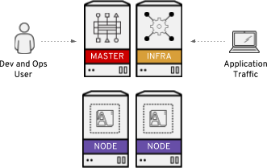

# [Red Hat OpenShift Container Platform in Microsoft Azure](https://docs.microsoft.com/en-us/azure/virtual-machines/linux/openshift-get-started)

This is an Azure Resource Manager template that provisions a HA OpenShift environment (1-5 master, 1-3 infra, and 1-30 app node) that is suitable for demos, POCs and small workshops.



## Prerequisites

### 1. Fork the `openshift-arm-setup` repo

Forking is a simple two-step process.

1. On GitHub, navigate to the <https://github.com/ecwpz91/openshift-arm-setup> repo.
2. In the top-right corner of the page, click **Fork**.

That's it! Now, you have a [fork][git-fork] of the original ecwpz91/openshift-arm-setup repo.

### 2. Create a local clone of your fork

Right now, you have a fork of the `openshift-arm-setup` repo, but you don't have the files in that repo on your computer. Let's create a [clone][git-clone] of your fork locally on your computer.

```sh
git clone git@github.com:your-username/openshift-arm-setup.git
cd openshift-arm-setup

# Configure git to sync your fork with the original repo
git remote add upstream https://github.com/ecwpz91/openshift-arm-setup

# Never push to upstream repo
git remote set-url --push upstream no_push
```

### 3. Verify your [remotes][git-remotes]

To verify the new upstream repo you've specified for your fork, type `git remote -v`. You should see the URL for your fork as `origin`, and the URL for the original repo as `upstream`.

```sh
origin  git@github.com:your-username/openshift-arm-setup.git (fetch)
origin  git@github.com:your-username/openshift-arm-setup.git (push)
upstream        https://github.com/ecwpz91/openshift-arm-setup (fetch)
upstream        no_push (push)
```

### 4. No `git`? No problem!

```sh
DIRPATH="${HOME}/Downloads/openshift-arm-setup"; GITUSER="ecwpz91"
GITREPO="https://github.com/${GITUSER}/openshift-arm-setup/archive/master.zip"
ARCHIVE="$(printf "%s" "${GITREPO##*/}")"

# Download and extract
wget $GITREPO \
&& temp="$(mktemp -d)" \
&& unzip -d $temp $ARCHIVE \
&& mkdir -p $DIRPATH \
&& mv $temp/*/* $DIRPATH \
&& rm -rf $temp $ARCHIVE \
&& cd $DIRPATH \
&& unset DIRPATH GITUSER GITREPO ARCHIVE temp
```

## Setup/Config

The following requires Azure CLI 2.0.8 or later. You can verify the CLI version with the `az --version` command. To update the CLI version, see [Install Azure CLI 2.0](https://docs.microsoft.com/en-us/cli/azure/install-azure-cli?view=azure-cli-latest).

### 1. [Sign in to Azure](https://docs.microsoft.com/en-us/azure/virtual-machines/linux/openshift-prerequisites#sign-in-to-azure)
```sh
az login
```

### 2. [Create a resource group](https://docs.microsoft.com/en-us/azure/virtual-machines/linux/openshift-prerequisites#create-a-resource-group)
```sh
az group create --name keyvaultrg --location eastus
```

### 3. [Create a key vault](https://docs.microsoft.com/en-us/azure/virtual-machines/linux/openshift-prerequisites#create-an-ssh-key)
```sh
az keyvault create --resource-group keyvaultrg --name changeme --enabled-for-template-deployment true --location eastus
```

 **Notice** the name for the keyvault must be _globally unique_ to Azure.

### 4. [Create an SSH key](https://docs.microsoft.com/en-us/azure/virtual-machines/linux/openshift-prerequisites#create-an-ssh-key)
```sh
ssh-keygen -f ~/.ssh/openshift -t rsa -N ''
```

### 5. [Store the SSH private key in Azure Key Vault](https://docs.microsoft.com/en-us/azure/virtual-machines/linux/openshift-prerequisites#store-the-ssh-private-key-in-azure-key-vault)
```sh
az keyvault secret set --vault-name changeme --name keysecret --file ~/.ssh/openshift
```

### 6. [Create a service principal](https://docs.microsoft.com/en-us/azure/virtual-machines/linux/openshift-prerequisites#create-a-service-principal)
```sh
az ad sp create-for-rbac --role contributor --scopes $(az group show --name keyvaultrg --query id | sed -e 's/\"\(.*\)\"/\1/')
```

### 7. Set environment variables (optional) and update `azuredeploy.parameters.json`
```sh
export AZURE_CLIENT_ID="" #appID/aadClientId
export AZURE_SECRET="" #password/aadClientSecret
export AZURE_SUBSCRIPTION_ID=""
export AZURE_TENANT="" #tenant
export AZURE_LOCATION=""
```

## Deployment

The following example deploys the cluster and all related resources into a resource group named `keyvaultrg`, with a deployment name of `ocpdeployment`. The template is referenced directly from this folder, and a local parameters file named `azuredeploy.parameters.json` file is used.

```sh
az group deployment create -g keyvaultrg --name ocpdeployment --template-file ./azuredeploy.json --parameters @./azuredeploy.parameters.json
```

## Teardown

Use the `az group delete` command to remove the resource group, OpenShift cluster, and clean up all related resources when they're no longer needed.

```sh
az group delete -n keyvaultrg
```
